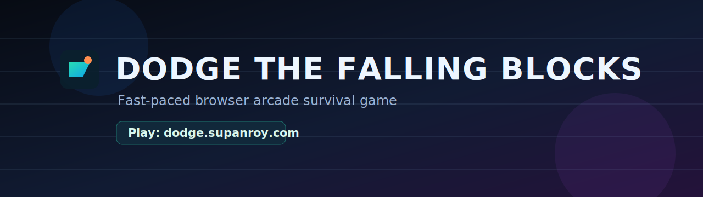
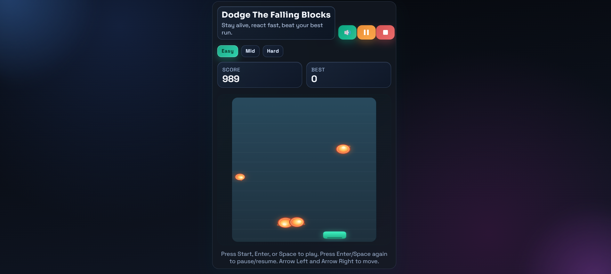

# Dodge The Falling Blocks

A fast-paced browser arcade game where you dodge falling objects, survive longer, and chase your best score.

## Play Online

Play Now: [dodge.supanroy.com](https://dodge.supanroy.com)

## Screenshot

## Highlights

- Smooth keyboard and touch controls
- Start, pause/resume, stop, and sound controls
- Difficulty modes: Easy, Mid, Hard
- Dynamic object styles that evolve with score
- Timed weird-object variants in higher-intensity play
- Built-in fairness logic so escape paths remain possible

## Controls

- Move: Arrow Left / Arrow Right
- Move (alt): A / D
- Start or pause/resume: Enter or Space
- Mobile: tap to start/resume, drag to move

## Difficulty

- Easy: calmer spawn pace, lower speed
- Mid: balanced challenge
- Hard: denser spawns, faster pace, weird objects arrive much sooner

## Tech

- HTML5
- CSS3
- Vanilla JavaScript
- Canvas 2D API

## Local Run

1. Open the project folder in VS Code.
2. Start a local server (for example, Live Server).
3. Open `index.html` in the browser.

## Project Structure

- `index.html` - UI and layout
- `game.js` - game logic and rendering
- `Sound Effects/` - game audio assets

## License

This project is licensed under the MIT License. See [LICENSE](LICENSE).

## Credits

Made by Jennet Caret Games  
Developed by Supan Roy